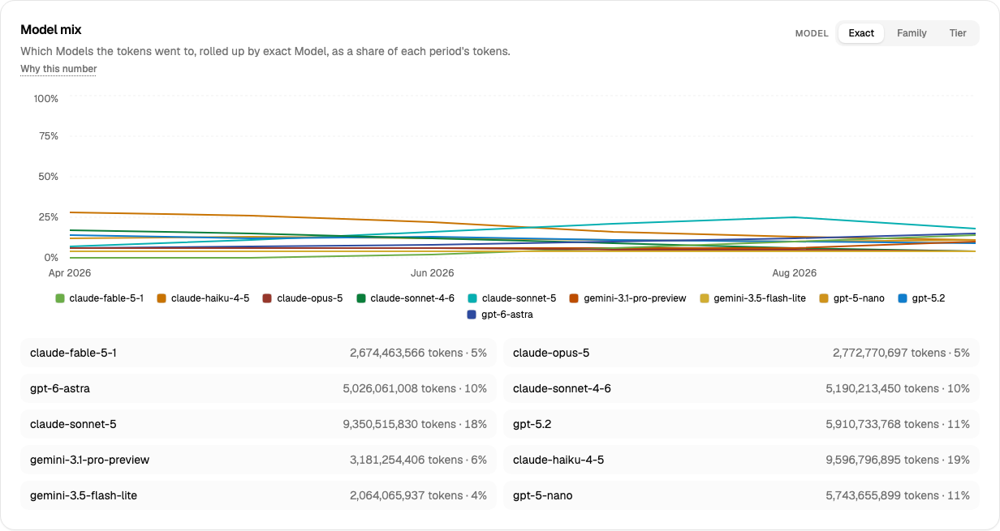
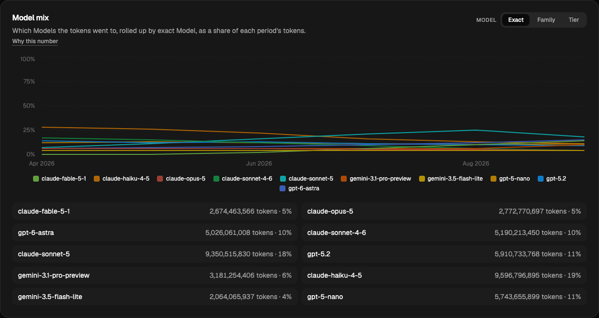

Type: implementation
Status: resolved
Blocked by: 68, 71
Label: resolved

# Model roster to Fable and Astra, families with a month-by-month presence, and a distinct palette for the Model mix

## Goal

The Model mix shows the **full range** of what a team actually moved between across the window:
Claude from Haiku to Fable, OpenAI from nano to Astra, Gemini on the side. Presence changes over
time — Haiku popular in April–June and down to ~10% by September, Sonnet 5 taking over from
Sonnet 4.6, Fable and Astra arriving late. Token share by vendor lands at **60% Anthropic, 30%
OpenAI, 10% Google** over the window. The Model mix panel draws one line per family over time
in a palette of its own, more distinctive than the five shared chart colours.

Decided by the human, 2026-09-10 (confirmed: amend R-V7 for the Model mix panel only, ten
colours).

## What exists today

- `src/fixtures/data/models.json` — seven models, three vendors, tiers 2/2/3; `family` carries
  the vendor line ("Claude Sonnet", "OpenAI GPT-6 Astra"). `rate_cards.json` token card with
  uniform derivation (cache read 0.1×, cache write 1.25×, output 5× of input). ADR-0007 pins
  the roster and the real 200× input spread (`gpt-6-astra` 10.00 vs `gpt-5-nano` 0.05).
- `targets.mts` — `TIER_TOKEN_SHARE` 55/30/15, `FRONTIER_SHARE_BY_MONTH` 25% → 10%,
  `MODEL_WEIGHT_WITHIN_TIER`, `MULTI_MODEL_SHARE` 0.4. R-D16 (derived invariant: frontier
  carries the most token spend on the smallest token share), R-D17 (frontier falls).
- Committed monthly family shares are flat: Sonnet ~30%, Gemini Pro ~22%, Haiku ~10% every month.
- `src/domain/series.ts` — `CHART_COLOR_VARS` (five), `SERIES_LIMIT` derived from it; R-V5 ranks
  and caps at top 4 + Other. `globals.css` `--chart-1..5` light and dark.
- `src/data/queries/adoption.ts` — `ModelMixPanel` (chart shape `bar`, all three levels).

## Scope

1. **Roster** (`catalog.mts`, `models.json`, `rate_cards.json`), ten models. Prices are real
   first-party input rates, output and cache classes by the existing uniform derivation:

   | id | vendor | family | tier | input $/M |
   |---|---|---|---|---|
   | `claude-fable-5-1` | Anthropic | Claude Fable | frontier | 10.00 |
   | `claude-opus-5` | Anthropic | Claude Opus | frontier | 5.00 |
   | `claude-sonnet-5` | Anthropic | Claude Sonnet | balanced | 2.00 |
   | `claude-sonnet-4-6` | Anthropic | Claude Sonnet | balanced | 3.00 |
   | `claude-haiku-4-5` | Anthropic | Claude Haiku | fast | 1.00 |
   | `gpt-6-astra` | OpenAI | OpenAI GPT-6 Astra | frontier | 10.00 |
   | `gpt-5-2` | OpenAI | OpenAI GPT-5 | balanced | *verify* |
   | `gpt-5-nano` | OpenAI | OpenAI GPT-5 | fast | 0.05 |
   | `gemini-3.1-pro-preview` | Google | Gemini Pro | balanced | 2.00 |
   | `gemini-3.5-flash-lite` | Google | Gemini Flash-Lite | fast | 0.30 |

   Check `gpt-5-2`'s id and price against OpenAI's current list the way ADR-0007 did, and record
   the check in a new ADR-0011 that amends 0007 (roster grows; the 200× spread still holds: Fable
   and Astra 10.00 against nano 0.05). Families are the vendor line across versions, which is
   why Sonnet 4.6 and 5 share one and GPT-5 nano and GPT-5.2 share one — that is the "existing
   naming approach" applied.
2. **Presence by month** — replace `FRONTIER_SHARE_BY_MONTH` with `FAMILY_SHARE_BY_MONTH`
   (Apr … Sep, share of tokens, rows sum to 1), authored to these stories and asserted ±2 points:
   - Claude Haiku: 28, 26, 22, 16, 12, 10.
   - Claude Sonnet: 24, 26, 28, 30, 30, 30 (within it, Sonnet 4.6 : Sonnet 5 goes 70:30 in
     April to 5:95 in September).
   - Claude Opus: 6, 6, 6, 5, 5, 5. Claude Fable: 0, 0, 2, 6, 10, 13.
   - OpenAI GPT-5 (nano + 5.2): 26, 25, 24, 22, 20, 18. GPT-6 Astra: 6, 7, 8, 10, 12, 13.
   - Gemini Pro + Flash-Lite: 10 every month, Pro : Flash-Lite 60:40.
   Vendor totals over the window: Anthropic ≈ 60%, OpenAI ≈ 30%, Google ≈ 10% — assert ±3 points.
   Keep `MULTI_MODEL_SHARE`. Delete `TIER_TOKEN_SHARE` as a target; **derive** the tier shares
   and keep R-D16's invariant as an assertion (frontier: Opus + Fable + Astra ≈ 12–30% of tokens,
   rising, and still the largest token spend). R-D17 is rewritten: frontier *rises* late in the
   window as Fable and Astra arrive; the optimisation story moves to Haiku's fade.
3. **Chart.** The Model mix panel becomes a **line chart of share over time**: one line per
   series at the chosen level (exact: 10, family: 7, tier: 3), y-axis 0–100%, page grain buckets,
   `stackable: false`; the levels table stays. R-V5's cap for this chart is the new palette's
   length, so nothing is folded into Other at any level.
4. **Palette.** Add `MODEL_MIX_COLOR_VARS` (`--model-1..10`) in `series.ts`, and a
   `paletteFor(chart)` seam so `seriesViewModel` takes the palette as an argument; every other
   chart keeps `CHART_COLOR_VARS`. Colours: vendor-hued — Anthropic in five warm steps
   (terracotta → ochre), OpenAI in three cool steps (navy → teal), Google two greens — with
   light and dark values. **Load the `dataviz` skill before picking values** and run its palette
   validator for contrast in both themes; keep the swatch SVG integer-only (T-E4).
5. **Spec.** R-V7 amended: "The five-colour palette is never extended **for comparison charts**;
   the Model mix panel, where the series set is a closed roster, carries its own ten-colour
   palette, capped at the roster." R-D16/R-D17 rewritten as above; R-M7 unchanged (still a
   breakdown, never an axis). CONTEXT.md § Models & Money roster table; ADR-0011.

## Done when

- Generator asserts the monthly family table, the vendor split and the R-D16 derived invariant.
- Unit: `seriesViewModel` with the mix palette emits ten distinct `colorVar`s and no Other;
  with the shared palette still caps at five (existing tests unchanged).
- e2e: Model mix legend on `/demo/spend` at exact level lists ten models; Haiku's September
  share reads ≤ 12% in the table mirror; screenshot in light and dark attached to the ticket.
- All six gates green.

## Comments

### 2026-09-10 — implemented

Branch `ticket/70`, off `main` at ticket 68. All five Scope items landed; every Done-when bullet is
covered by a test named below. Two figures in the ticket were arithmetically wrong and one string
was not real; all three are recorded here and in
[ADR-0011](../../../docs/adr/0011-the-roster-grows-to-ten-and-the-mix-moves.md).

**The Model mix, light and dark:**

#### Six gates, all green

| Gate | Result | Counts |
|---|---|---|
| `pnpm lint` | pass | clean, no warnings |
| `pnpm typecheck` | pass | — |
| `pnpm test` | pass | **1,544** tests in 65 files (1,530 before, +14) |
| `pnpm test:coverage` | pass | statements 98.30% · branches 89.45% · functions 99.03% · lines 99.47% |
| `pnpm build` | pass | 10 routes, no warning |
| `PORT=3110 pnpm e2e` | pass | **187** tests (182 before, +5) · **1m 34s** wall |

`pnpm fixtures:generate` is **byte-stable across two consecutive runs**, and both runs are
byte-identical to the committed `src/fixtures/data/**` (`diff -r` over two temp outputs and the
committed tree).

#### The fixture, after

Structure untouched — the ticket only re-priced and re-mixed the tokens, so the schedule, the work
mix and the fan-out are byte-for-byte ticket 68's:

| | before | after |
|---|---|---|
| Models · families · vendors | 7 · 7 · 3 | **10 · 8 · 3** |
| Rows on disk / visible roots / children / Tasks | 10,854 / 7,761 / 2,935 / 3,626 | unchanged |
| Tokens over the window | 59.5B | **61.5B** |
| Session cost · seat share | $59,257.83 · 6.6% | **$72,682.16 · 5.5%** |
| Session cost median · p95 | $3.02 · $26.62 | **$3.28 · $35.14** |
| Median human Member-month | ~110M | **110.0M** (99.4 / 76.2 / 139.4 / 110.0 by full month) |
| Tier token share | balanced 55 / fast 30 / frontier 15 (authored) | **balanced 45.9 / fast 32.0 / frontier 22.1** (derived) |
| Tier token *spend* share | frontier 50.2% on 14.9% of tokens | **frontier 62.5% on 22.1% of tokens** (balanced 31.4, fast 6.1) |
| Weeks repaired onto the spend curve | 3 of 24 | **3 of 24** (worst surviving departure 29.9% vs ±40%) |

**Realised vendor split over the window: Anthropic 58.0%, OpenAI 31.9%, Google 10.1%** — against
60 / 30 / 10 asked for at ±3 points. **Frontier rises 11.6% → 31.5%** April to September;
**`claude-haiku-4-5` fades 28.0% → 10.3%**. Every family lands inside ±2 points of the authored
table in every month.

#### `gpt-5.2` — verified, and the ticket's id was wrong

Checked against OpenAI's own pricing and model pages on 2026-09-10, the way ADR-0007 checked its
seven on 2026-09-07.

- **The id is `gpt-5.2`, with a dot.** The ticket proposed `gpt-5-2`; OpenAI publishes `gpt-5.2`
  and `gpt-5.2-pro` and nothing spelled `gpt-5-2`. The real string ships, on ADR-0007's own
  standard, and it costs nothing: the roster already carried a dot in `gemini-3.1-pro-preview`, and
  `e2e/support/costs.ts` already excludes a decimal inside an identifier from T-E4's search set —
  `5.2` is excluded by exactly the rule that excludes `3.1`, with no change to the scanner.
- **The price is $1.75 / MTok input** (output $14.00, first-party). The derived classes follow:
  0.175 cache read, 2.1875 cache write, 8.75 output.
- **Not reconciled, and recorded rather than averaged:** third-party aggregators quote $0.875 for
  the same model and describe it as a recent 50% cut. The first-party page is what ADR-0007 checked
  against and is what ships. It is structurally inert either way — `gpt-5.2` is `balanced` at both
  figures and neither end of the 200× spread runs through it.

#### Escalations, and the cheaper option taken each time

1. **Three of the six authored family rows sum to 99, not 100.** July, August and September as
   written add to 99 points. *Cheaper option:* keep the authored numbers as the readable thing and
   **normalise each row to 1** in `FAMILY_SHARE_BY_MONTH`. Cost: each family in those months moves
   by at most 0.3 of a point, and the generator asserts against the **authored** figures at ±2, so
   the normalisation is inside the tolerance rather than hidden by it. Rejected: re-authoring three
   rows, which would have been inventing a share the human did not write.
2. **The ticket says "family: 7"; the roster it specifies has eight families.** Claude Fable, Opus,
   Sonnet, Haiku · OpenAI GPT-5, GPT-6 Astra · Gemini Pro, Gemini Flash-Lite. *Cheaper option:*
   take the roster table as the spec and let the family count be eight. Cost: none — the palette is
   ten and caps at the roster, so eight lines fit with two slots spare. Every count in the specs
   and the tests is now derived from `models.json` rather than typed, so the next roster edit
   cannot re-open this.
3. **The split inside `OpenAI GPT-5` is not authored anywhere.** The ticket gives the family a
   monthly share and names no `gpt-5-nano` : `gpt-5.2` ratio. *Cheaper option:* **a flat 50:50**,
   `GPT_5_NANO_WITHIN_FAMILY = 0.5`. Cost: it puts one `fast` model and one `balanced` model at
   equal weight and adds no story nobody asked for. Any other number would have been a claim.
4. **Colour follows a series' rank, not the Model it names.** The ticket asks for a `paletteFor`
   seam that hands `capSeries` a palette, and `capSeries` paints by walking the palette — which is
   the construction that makes "a series with no colour could not be emitted" true. So the vendor
   hues are a property of the palette as a **set** (five warm, three cool, two green) and not a
   mapping from vendor to hue: at the exact level `claude-haiku-4-5` takes `--model-1` because it
   ranks first, not because it is Anthropic's. *Cheaper option:* implement the seam the ticket
   describes and record the consequence. Cost: the vendor grouping reads as palette composition
   rather than as semantics. Pinning colour to the entity would need a `colorOf` on `SeriesInput`
   and an R-V5 amendment, neither of which is in scope.
5. **A ten-colour categorical palette cannot pass the `dataviz` all-pairs gates, and does not.**
   Run with the skill's own `validate_palette.js` in both themes. On the **adjacent** pairlist —
   the documented one for lines, stacks and bars — everything passes with margin: worst CVD ΔE
   **11.3** light / **10.2** dark against a target of 8, worst normal-vision ΔE **22.1** / **20.9**
   against a floor of 15, lightness band and chroma floor clean in both. Under `--pairs all` it
   fails at ΔE 4.0 / 6.4 light and 2.6 / 5.2 dark. That is the documented series cap binding: the
   skill's own reference palette cannot clear all-pairs past **three** slots, and no re-ordering or
   re-stepping fixes it because the all-pairs pairlist stops depending on order. I searched for a
   better set under the ticket's vendor-hue constraint (five warm steps in one ramp) and the best
   all-pairs normal-vision minimum reachable was ~8, worse on adjacent. *Cheaper option:* keep the
   adjacent-optimised set, ship the relief the rule requires, and write the numbers down. The
   relief is real and this panel has more of it than any other chart: every series is named beside
   its swatch in the legend, the levels table under the chart names every Model with its exact
   token count and share, and the R-X1 mirror carries every figure — identity is never colour-alone
   here.
6. **The slot order is not the vendor order, and Recharts renders the legend alphabetically.** The
   palette interleaves the three hue families (warm3, cool3, warm4, cool2, green1, cool1, warm2,
   green2, warm1, warm5), because five warm steps in consecutive slots cannot clear the adjacent
   gates in the dark band — 0.48–0.67 of lightness is 0.19 to spread five steps across. Recharts
   3.10 then sorts the legend by series key, so legend adjacency is alphabetical rather than
   ranked; the swatch colours are still the ViewModel's. *Cheaper option:* leave Recharts' legend
   ordering alone. Cost: it is another reason the honest pairlist here is all-pairs, which is
   escalation 5.
7. **The pinned 0–100% axis leaves the lines in the bottom third of the card.** No Model exceeds
   ~30% of a month's tokens at the exact level, so seven tenths of the plot is empty. The ticket
   specifies the domain, and it is the right call for a share — an auto-scaled axis would redraw a
   40% line at the top of the card and read as dominance, and a filter changing the maximum would
   silently rescale the picture. *Cheaper option:* keep 0–100 as specified and note the
   legibility cost here. At `tier` the chart uses more of its height (balanced ~46%).

#### Consequences worth naming, beyond the Scope

- **`family` and `tier` stopped being a chain.** `OpenAI GPT-5` holds `gpt-5-nano` (`fast`) and
  `gpt-5.2` (`balanced`), which the ticket's own roster requires. All three levels still partition
  the same tokens exactly — `aggregate.ts` sums each from the **exact** entries — so T-U17's real
  claim is untouched; what is gone is `exact ⊂ family ⊂ tier`, which one fixture test had assumed.
  `CONTEXT.md`, `testing-spec.md` T-U17 and ADR-0011 all now say so.
- **R-D4's spend curve had to be re-fitted, and R-D17 is the whole of the reason.** The curve was
  *shallower* than the volume curve because the average priced token got cheaper across the window;
  it now gets dearer (~0.68¢ → ~1.21¢ per thousand), so the curve is steeper — 1,600 / 5,700 at
  midpoint 0.65 and steepness 6.5, ~$1,666 at the open to ~$5,138 at the close. Its midpoint and
  steepness are its own for the first time: volume flattens across August and the mix does not, so
  a logistic on λ's midpoint cannot follow their product. Bands, repair threshold and repair count
  are untouched, and there is still no separate price ramp in the generator.
- **Cost per completed Task now rises across the window** where it used to fall, which inverted one
  fixture test. It asserts the new direction, derived from the committed rows at both ends, and no
  number is written down in it.
- **Two magnitude literals were re-derived rather than re-typed** (`testing-spec.md` § T-F's rule):
  R-D10's seat-holder multiple over the Organization, which fell from 3.3× to 2.7× because the
  Organization's own figure rose with the mix — it is now asserted as the ranking (she is the
  maximum, exactly), plus floors against the Organization and against the median Member that sit
  well under what the fixture reads; and the R-D16 tier shares in `adoption.fixture.test.ts`, which
  were 55 / 30 / 15 literals and are now the ordering the family table implies plus the partition.

#### What changed, by file

- **Fixture generator.** `catalog.mts` (ten-model roster, `modelFamilies`), `targets.mts`
  (`FAMILY_SHARE_POINTS` / `FAMILY_SHARE_BY_MONTH` / `SONNET_4_6_WITHIN_FAMILY` /
  `GPT_5_NANO_WITHIN_FAMILY` / `VENDOR_TOKEN_SHARE` / `FRONTIER_TOKEN_SHARE_BAND`, `WINDOW_MONTHS`,
  `MODEL_FAMILIES`; **`TIER_TOKEN_SHARE`, `FRONTIER_SHARE_BY_MONTH` and `MODEL_WEIGHT_WITHIN_TIER`
  deleted**; `WEEKLY_SPEND_SHAPE` re-fitted), `tokens.mts` (`modelTargets` / `tierTargets` derived
  from the family table), `spend.mts` (`familyMixLines`, the derived R-D16 assertions, R-D17
  rewritten to rise), `invariants.mts`, `invariants.test.ts`, and the regenerated
  `src/fixtures/data/**`.
- **Domain.** `series.ts` (`MODEL_MIX_COLOR_VARS`, `ChartPalette`, the cap taken from the palette),
  `viewmodel.ts` (`PALETTE_BY_GROUPING`, `paletteFor`), `aggregate.ts` (the partition comment).
- **Data layer.** `queries/adoption.ts` — `modelCells` emits a share in whole points, the chart's
  measure is `ratio`.
- **Components.** `globals.css` (`--model-1..10`, light and dark, with the validator's numbers
  beside them), `panels/token-chart.tsx` (`ModelMixChart`, `measureDomain` [0, 100]),
  `panels/figures.ts` (`sharePointTick`), `panels/adoption-section.tsx`, `panels/spend.fixture.ts`.
- **Tests.** `domain/series.test.ts` (+5), `domain/viewmodel.test.ts` (+3), `data/queries.test.ts`
  (+6), `data/adoption.fixture.test.ts`, `data/spend.fixture.test.ts`,
  `components/panels/adoption-section.test.tsx`, and a new `e2e/model-mix.spec.ts` (T-E20, 5 tests)
  with `models()` added to `e2e/support/fixture.ts`.
- **Docs.** `docs/adr/0011-…`, `CONTEXT.md` § Models & Money (roster table, the roll-up note, Model
  mix over time), `spec.md` (R-V4, R-V7, R-D3, R-D4, R-D16, R-D17, R-N9 item 7, the R-V1 note,
  A13), `technical-spec.md` (R-T24, R-T30), `testing-spec.md` (T-U11, T-U17, T-F4, T-E4's exclusion
  list, new T-E20), `src/fixtures/README.md`, `README.md`, and the two screenshots in `docs/img/`.

#### Left undone

Nothing in Scope. Two things deliberately out of it and named above rather than done: colour is not
pinned to the Model it names (escalation 4), and the 0–100% axis leaves the plot sparse
(escalation 7). Both would need a spec amendment this ticket does not carry.
