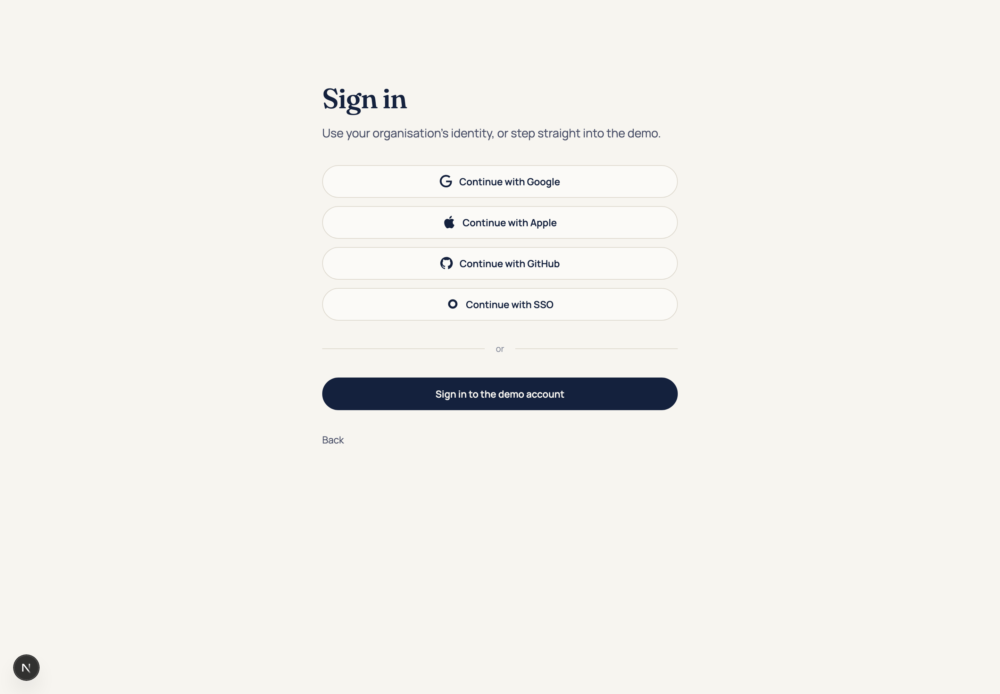
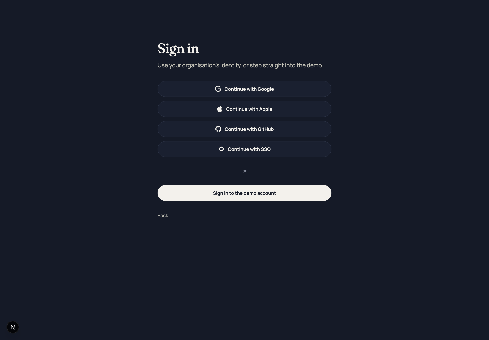
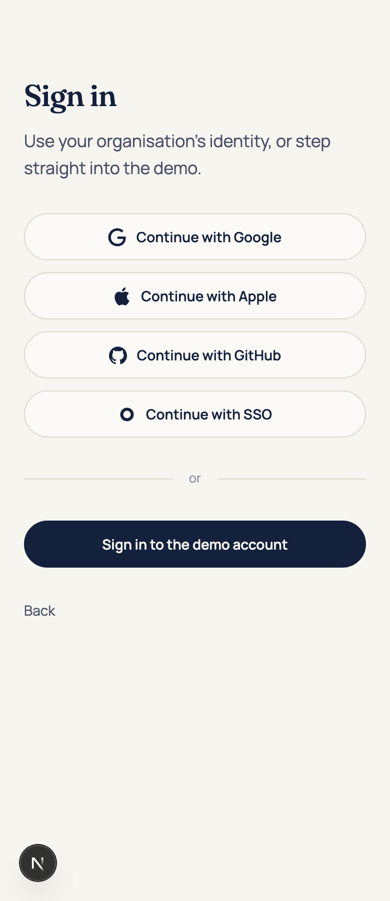
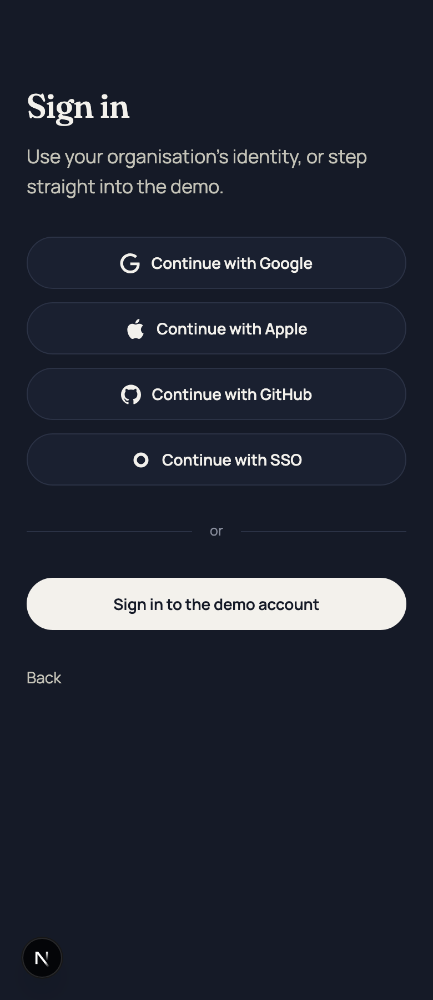

Type: implementation
Status: resolved
Blocked by:
Label: resolved

# `/sign-in` reads as a real sign-in page: SSO is a fourth provider link, the demo is a fifth button

## Goal

`/sign-in` still announces itself as a demo twice over: a disabled email input under a `Work
email` label with a line admitting single sign-on is not connected, and the demo action wrapped in
a bordered card carrying a `DEMO ACCOUNT` label, a sentence of explanation and a sentence of
navigation advice. Both are scaffolding described in prose rather than a page.

After this ticket the page is a heading, a sentence, and **five pills in one column**: four
identity links (Google, Apple, GitHub, SSO) and, under a hairline, the one button that works.
Nothing on the page explains itself.

Decided by the human, 2026-09-10. Nothing below is open; do not ask, build.

## What exists today

- `src/app/(public)/sign-in/page.tsx` — `PROVIDERS` (three), `ProviderRow` (`flex-col gap-3
  sm:flex-row`), `Divider`, `SsoBlock` (label + disabled `input[type=email]` + disabled
  `button[type=button]` + the "not connected" line), `DemoCard` (the page's only `<form
  method="post" action="/api/session">`, `aria-labelledby="demo-account"`, inside a bordered
  `--landing-claims` card with a small-caps label, a sentence naming Nuria, the submit button, and
  a closing line about the header switcher). `PILL` and `SMALL_CAPS` are module constants.
- `src/app/(public)/sign-in/provider-glyphs.tsx` — `frame()` plus three `currentColor` marks.
- Counts asserted today: `e2e/smoke.spec.ts` — 4 links, 3 `a[target="_blank"]`, 1 `main form`,
  1 `main button[type=submit]`, and the SSO button disabled; `page.test.tsx` — the same, plus the
  "not connected" sentence and the form reached by its accessible name.
- `docs/landing/img/picture-v2.html` covers `/` only, so no reference render contradicts this.

## Scope

Touch `src/app/(public)/sign-in/**`, the tests named under § Tests, and the docs named under
§ Docs. Nothing else — in particular not `src/app/(public)/page.tsx`, not `globals.css`, and
nothing under `src/domain/**` or `src/data/**`.

1. **SSO becomes the fourth provider.** Delete `SsoBlock` entirely — the label, the disabled
   input, the disabled button and the "Single sign-on is not connected in the demo." line. Add a
   fourth entry to `PROVIDERS`:

   | Label | `href` |
   |---|---|
   | `Continue with SSO` | `https://zencoder.okta.com/` |

   Same `<a target="_blank" rel="noopener noreferrer">` as the other three; nothing is exchanged,
   the link is the whole integration. **The label stays `Continue with SSO`, not "Continue with
   Okta"** — the page reads as a real sign-in and the tenant behind it is only visible to whoever
   clicks. That is the whole joke and it is not explained on the page or in a code comment beyond
   one dry line naming it a placeholder tenant.
2. **An Okta glyph** in `provider-glyphs.tsx`, in the existing house style: one monochrome
   `currentColor` mark on the 24-unit box, `aria-hidden`, no icon library. Okta's mark is a ring;
   a stroked circle is enough (`fill="none"`, `<circle cx="12" cy="12" r="7"
   stroke="currentColor" stroke-width="4">`), and `frame()` already lets a caller override `fill`.
   Check it optically beside the other three at 18px — the ring must not read heavier than the
   GitHub mark.
3. **One column of pills.** Four provider links at 130px each do not fit a 560px column, so
   `ProviderRow` loses `sm:flex-row` and becomes a single stacked list of full-width pills at
   every breakpoint. This is what a real provider page looks like; the side-by-side row was only
   ever possible because there were three.
4. **The demo card becomes a fifth pill.** `DemoCard` keeps exactly one thing — the `<form
   method="post" action="/api/session">` with its hidden `member_id` and its submit button — and
   loses the border, the card surface, the padding, the `DEMO ACCOUNT` label, the sentence naming
   Nuria and the sentence about the header switcher. The `form` becomes a bare block whose only
   child pair is the hidden input and the button; give it `aria-label="Demo account"` so the unit
   test can still reach it by name without rendering a visible label.
   - The button keeps its label **`Sign in to the demo account`** verbatim — `enforcement.spec.ts`
     clicks it by name twice and that behaviour is not in scope.
   - It keeps the `PILL` geometry (same radius, padding, text size) and **keeps the filled-ink
     treatment**: it is the only control on the page that does anything, and a sign-in page marks
     its primary action. "Another button, similar to the previous four" is about shape and rank,
     not about hiding which one works.
5. **The divider moves.** `Divider` ("or") now sits between the four identity pills and the demo
   button, which is what the supporting paragraph already promises: *"Use your organisation's
   identity, or step straight into the demo."* Keep both.
6. `SMALL_CAPS` is left unused once the two labels go — delete the constant, do not leave it for
   lint to find.
7. **The page's file header comment** currently describes the SSO block and the card. Rewrite it
   to describe what is there: five pills, four of which are places and one of which is the only
   action; why the four are anchors and the fifth is a form (an anchor cannot POST without the
   JavaScript this page refuses to ship); and that the restricted account is still not offered.

## What is deliberately lost

The line *"Switch to the restricted contractor view from the header on any page."* goes with the
card. After this ticket the contractor account is discoverable **only** from the header switcher
(R-A5) — which is where README § 2 step 4 already sends a reader, and where `routes.spec.ts` and
`mobile.spec.ts` exercise it. Recorded here so it reads as a decision rather than an oversight.
The unit test asserting the restricted account's name is absent from `/sign-in` gets *stronger*,
not weaker: nothing on the page refers to it at all.

## Tests

**Update — counts and strings only, no new scope:**

- `src/app/(public)/sign-in/page.test.tsx`:
  - the provider test's `expected` table gains `["Continue with SSO", "https://zencoder.okta.com/"]`
    and its title says four pills;
  - the "offers SSO as a disabled button" test is **deleted** — the SSO pill is covered by the row
    above, and there is no "not connected" sentence left to assert;
  - the link-count test goes 4 → **5** (four external, plus `Back` → `/`);
  - the form test still reaches `getByRole("form", { name: /demo account/i })` (now via
    `aria-label`) and still finds one submit named `Sign in to the demo account`;
  - the `member_id` test and the restricted-account-absent test are untouched.
- `e2e/smoke.spec.ts`, the ticket-60 sign-in test: links 4 → **5**; `a[target="_blank"]` 3 → **4**;
  the host loop gains `zencoder.okta.com`; the two disabled-SSO-button assertions are **deleted**;
  `main form` **1** and `main button[type=submit]` **1** are unchanged and are the point — the page
  gained a link, not an action. Update the comment above it.

**Must not change:** `e2e/enforcement.spec.ts` (the button's accessible name is unchanged — run
`grep -rn "Sign in to the demo account" e2e src` and confirm every hit still resolves),
`e2e/mobile.spec.ts` (T-E17 must still pass at 390 — a stacked column is easier than a row, but
verify rather than assume), `e2e/payload.spec.ts`, `e2e/routes.spec.ts`, anything under
`src/domain/**` or `src/data/**`.

## Docs

- `spec.md` § 3 route table, the `/sign-in` row: it still reads *"Two 'continue as' buttons, and a
  link back to `/`"*, which ticket 60 already made false and did not fix. It becomes: *"Four
  identity links (three providers and SSO), one 'sign in to the demo account' button, and a link
  back to `/`"*.
- `spec.md` R-A4: append one dated line after ticket 60's amendment, without renumbering —
  *Amended 2026-09-10, ticket 71: the SSO control is a fourth provider link, and the demo action is
  a bare form button rather than a described card.* R-N1's "one link on `/`" is untouched; the
  count on `/sign-in` goes 4 → 5.
- `docs/security.md` cites `src/app/sign-in/page.tsx` at four places (§ lines 14, 147, 181, 403)
  with a path that ticket 60 moved to `src/app/(public)/sign-in/page.tsx` and line numbers this
  ticket invalidates. Fix the path and re-resolve the line numbers at all four. Do not touch the
  arguments around them; the claims are unchanged — `/sign-in` still hands a session to any
  anonymous visitor, still with no password and no verification.
- Nothing in `testing-spec.md` moves: the smoke file it does not enumerate is where the counts live.

## Done when

- `pnpm lint` · `typecheck` · `test` · `test:coverage` · `build` · `e2e` (both Playwright
  projects) all green. Record the six results in `## Comments`.
- `/sign-in` renders five pills in one column at 1440 and at 390, no horizontal scroll at 390, and
  the forbidden-word regex (`faster|productiv|velocity|ship more|10x`) still passes. Screenshot at
  both widths, light and dark, attached to the ticket.
- Clicking `Continue with SSO` opens `https://zencoder.okta.com/` in a new tab and leaves
  `/sign-in` in place.
- `/sign-in` is still prerendered static in the `pnpm build` output.
- No visible text on the page describes the page.

## Notes

Filed 2026-09-10 as a blocker of [ticket 70](70-model-roster-presence-and-palette.md) so it lands
in the same wave. It is file-disjoint from all of 61–70 — it touches only the two sign-in files,
their two test files and three docs — so it can be taken by whichever session reaches it first.

---

## Comments

### 2026-09-10 — implemented

Branch `ticket/71`, off `main` at ticket 70. All seven Scope items landed; every Done-when bullet
is either covered by a test named below or verified by the measurement recorded here. The page is
now a heading, a sentence, five pills in one column, and a `Back` link — and nothing on it
describes it.

**`/sign-in`, 1440 and 390, light and dark:**

#### Six gates, all green

| Gate | Result | Counts |
|---|---|---|
| `pnpm lint` | pass | clean, no warnings |
| `pnpm typecheck` | pass | — |
| `pnpm test` | pass | **1,542** tests in 65 files (1,544 before, **−2**: the two tests this ticket deletes) |
| `pnpm test:coverage` | pass | statements 98.30% · branches 89.45% · functions 99.03% · lines 99.47% |
| `pnpm build` | pass | 10 routes; `/sign-in` prints `○ (Static)` |
| `PORT=3111 pnpm e2e` | pass | **187** tests, both projects (`chromium` + `mobile-chromium`), unchanged · **1m 36s** wall |

#### Done-when, measured

- **Five pills in one column, both widths.** Measured from the rendered page: at 1440 the five
  controls are all `x=464, width=512`, at `y` 237 / 296 / 355 / 414 / 544; at 390 all five are
  `x=24, width=342`, at `y` 213 / 272 / 331 / 390 / 519. One column, one width, at every
  breakpoint; the larger gap before the fifth is the divider.
- **No horizontal scroll at 390.** `document.documentElement.scrollWidth === 390`. Also asserted
  by `mobile.spec.ts` T-E17 ("`/sign-in` does not scroll sideways"), which passes untouched.
- **The forbidden-word regex passes.** The page's whole text is the heading, one sentence, five
  labels, "or" and "Back"; none of `faster|productiv|velocity|ship more|10x` occurs.
- **`Continue with SSO` opens the tenant in a new tab and leaves `/sign-in` in place.** Driven in
  a real browser: the click emits a popup at `https://zencoder.okta.com/`, the opener stays at
  `/sign-in`, and `window.opener === null` in the popup (the `rel="noopener"` doing its job).
- **`/sign-in` is still prerendered static.** `pnpm build` prints `○ /sign-in`, which also keeps
  `docs/security.md` § 3's claim ("only `/`, `/sign-in` and `/_not-found` are prerendered") true.
- **The must-not-change check.** `grep -rn "Sign in to the demo account" e2e src` returns the same
  four hits as before — `e2e/enforcement.spec.ts:83`, `:98`, `page.tsx:100`, `page.test.tsx:25` —
  and all four resolve. `enforcement.spec.ts`, `mobile.spec.ts`, `payload.spec.ts`,
  `routes.spec.ts`, `src/domain/**` and `src/data/**` are untouched.

#### Already done when this ticket was picked up

§ What exists today was filed before ticket 61 landed and is stale in three places:

1. **The header-switcher sentence was already gone.** *"Switch to the restricted contractor view
   from the header on any page."* had already been deleted by ticket 61. § What is deliberately
   lost therefore describes a loss that had already happened; nothing in this ticket removed it.
2. **The card no longer hardcoded a name.** It read `openDefault.fullName` from the fixture, not
   "Nuria". The sentence went anyway, as Scope item 4 requires.
3. **`docs/security.md` had three of its four sign-in citations already corrected.** Only the § 1
   one still carried the pre-ticket-60 path, as `src/app/sign-in/page.tsx:77`; the other three
   (§ 2 CSRF, § 2 forced-session, § 6 "No real identity") had already been moved to
   `src/app/(public)/sign-in/page.tsx` **and had their line numbers dropped**. So "re-resolve the
   line numbers at all four" resolved to one edit: the § 1 citation is now
   `src/app/(public)/sign-in/page.tsx:94`, the `<form>` line. The three line-number-free citations
   were re-checked against the file and still land on true statements; adding line numbers back to
   them would only manufacture three more things to go stale. The two neighbouring citations in
   the same paragraphs (`src/data/viewer.ts:57`, `src/app/api/session/route.ts:62`) were re-checked
   and still resolve.

#### Escalations and choices

- **A test the ticket did not list had to go.** § Tests says the `member_id` test and the
  restricted-account-absent test are untouched and names one deletion (the disabled-SSO test).
  But ticket 61 added a seventh test — *"names that account from the fixture rather than from a
  literal"* — which asserts the string `You will be {fullName},`, and Scope item 4 deletes that
  sentence. The cheaper option is to delete the test with the sentence rather than invent a new
  visible use of `fullName` to keep it alive; the fixture-over-literal principle it guarded now
  has nothing on this page to guard, because the page names nobody. Cost: `signInAccounts()`'s
  `fullName` is no longer exercised from `/sign-in` — it still is from the header
  (`account-switcher`), which is where the name is rendered now. Unit tests therefore go 8 → 6 in
  this file (−1 SSO, −1 fixture-name), and the suite 1,544 → 1,542.
- **`docs/security.md` § 1 said "both seeded accounts are offered".** That is false since ticket
  61 and the citation this ticket re-resolves points straight at the form that offers exactly
  one — leaving it would have made the fixed citation contradict its own sentence. Three words
  changed to "the one offered account is handed to any anonymous visitor"; the argument around it
  (the dataset is not the asset; the access model is) is untouched, as § Docs requires. The
  paragraph was re-wrapped to the file's 99-column measure. Cost: one line of § Docs' "do not
  touch the arguments around them" read narrowly rather than literally.
- **Two components were renamed.** `ProviderRow` → `ProviderPills` and `DemoCard` → `DemoForm`.
  Neither is a rename the ticket asked for, but a function called `Row` that renders a column and
  one called `Card` with no card left in it are exactly the stale prose this ticket exists to
  delete. Cost: two identifiers in § What exists today no longer grep.
- **`PILL` now carries geometry only.** The demo button inverts the pill's colours, and
  `border-(--landing-rule)` versus `border-(--landing-ink)` in one class string is a specificity
  race Tailwind resolves by stylesheet order, not by the order they are written — a hard bug to
  see and an easy one to ship. Colour is set at each of the two uses instead. The geometry the
  ticket names (radius, padding, text size) is shared and identical across all five pills; the
  demo button's old `px-6 py-[13px] text-[15px]` is now the pills' `px-4 py-3 text-[14px]`.
- **The Okta ring, checked optically at 18px.** Rendered with the ticket's numbers (`r=7`,
  `stroke-width=4`, `fill="none"`). Its ink area is ≈176 square units against the GitHub mark's
  ≈340, so it does not read heavier — it reads slightly *smaller* than Google and GitHub, whose
  paths fill the 24-unit box while the ring's outer diameter is 18. That is the safe side of the
  constraint the ticket states, so the numbers were left as specified rather than grown to match.
- **No new e2e test for the SSO click.** § Tests says "counts and strings only, no new scope", so
  the Done-when bullet about the new tab was verified by driving a browser once (recorded above)
  rather than by adding a spec. `smoke.spec.ts` keeps the structural claim: the pill is an
  `a[target="_blank"][rel~=noopener]` pointing at `zencoder.okta.com`.

#### Files changed

- `src/app/(public)/sign-in/page.tsx` — `SsoBlock` and `SMALL_CAPS` deleted; `PROVIDERS` gains
  SSO; one stacked column; the form reduced to a hidden input and a button, named by `aria-label`;
  the divider moved above it; the file header rewritten to describe five pills rather than a card.
- `src/app/(public)/sign-in/provider-glyphs.tsx` — `OktaGlyph`, and the header comment now says
  three filled paths and one stroked ring.
- `src/app/(public)/sign-in/page.test.tsx` — four provider rows, five links, the form by
  `aria-label`; two tests deleted.
- `e2e/smoke.spec.ts` — the ticket-60 sign-in test: 5 links, 4 `_blank`, the Okta host in the
  loop, the two disabled-SSO assertions gone, `main form` and `main button[type=submit]` still 1.
- `.scratch/agent-dash/spec.md` — § 3's `/sign-in` row, and R-A4's third dated amendment.
- `docs/security.md` — the § 1 citation.
- `docs/img/sign-in-{1440,390}-{light,dark}.png` — new.

