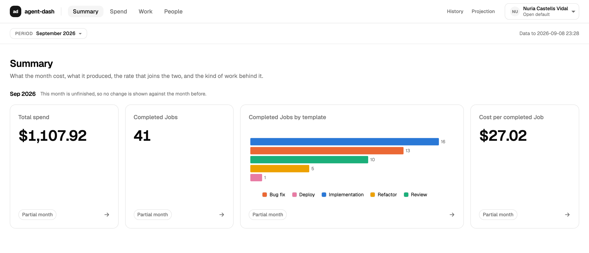

# agent-dash

Organisation-level analytics for a fictional cloud agent-execution platform: what the agents cost,
and what they finished. Built as a take-home, on fixture data throughout. The decisions are as much
the artefact as the code, so most of what follows points at where one is written down.

## 1. The claim, and the claim it refuses

**What your agents do, spend and solve, per finished job.**

Every agent platform tells you what you spent; none tells you what you got for it. This dashboard
joins the two. **Cost per completed Task** — attempts that produced nothing sit in the numerator and
not in the denominator, so waste raises the figure rather than hiding in it. It is for the
engineering leader who signs the agent bill and cannot explain it.

**It refuses to claim a productivity gain: no pre-agent baseline exists.** The observation window is
entirely agent-assisted, so a gain is unmeasurable here and the product never asserts the premise.
The refusal is a test rather than an intention — `e2e/smoke.spec.ts` fails the build if the landing
page acquires the vocabulary.

Three levers move the figure, and each has a surface behind it:

- **Model mix** — a genuine 200× input-price spread across tiers, so *which* model ran moves cost
  more than how many tokens it drew ([ADR-0007](docs/adr/0007-model-roster-spans-a-real-200x.md)).
- **Rework** — a Task that needed three attempts cost three times its price. Measurable only because
  Task and AgentSession are different things, which is why the domain model separates them.
- **Seats** — a seat held against near-zero usage is the most expensive unit of work in the org.
  One Member holds a $234 seat against $6.11 of sessions, which no consumption-only model can see:
  a seat is not a session and nothing in the session stream implies one. Seats are **6.6%** of
  Total spend on the committed fixture — a minor line, and a line a spend report has to carry.

**The default is open.** Individual spend is visible to everyone in the Organization, symmetric,
sortable, with no leaderboard and no minimum-population floor
([ADR-0003](docs/adr/0003-individual-visibility-is-open-by-default.md)). Restriction is the
mechanism, not the posture, and a restricted preset ships so that the mechanism is demonstrable.

**It is not** a billing page, a trace viewer, or a performance review tool.

*"Not per seat" is a claim about the reported unit, not about the cost base:* Total spend does
include seat cost — that is the point of the third lever. The contrast is with per-seat and
per-token *pricing models*.

The positioning in full, with what each line is held to:
[`docs/positioning.md`](docs/positioning.md).

## 2. Live, and the thirty-second path

**<https://agent-use-dash.vercel.app>** — public, no deployment protection. **One account is
offered**, no password: `/sign-in` signs anyone in to the open default. The header menu names who
you are and links back to `/sign-in`; it does not switch accounts.

| Account | Role | Sees | Offered? |
|---|---|---|---|
| **Nuria Castells** | Open default | *"Every Member of the Organization by name — their jobs, their tokens, their cost."* | Yes — the one demo action |
| **Héctor Camps** | Restricted (contractor) | *"Yourself by name; your Team's jobs and tokens as totals only, and no cost at all."* | **No — demonstrable only under test** |

**The restricted account is seated, not offered** (ticket 61). Its Role and grants are shipped and
unchanged, and it is the account the payload tests act as — but nothing in the product mints a
token for it, and `POST /api/session` answers 400 for its id. To watch the access model subtract
data you run the suite, not the site: `e2e/payload.spec.ts` and `e2e/people.spec.ts` install its
token directly from the fixture.

Walk it:

1. **Sign in to the demo account.** You are Nuria Castells, and you land on `/demo` — four tiles and nothing below them.
   September 2026 is the current month and it is unfinished, so every tile carries a **Partial
   month** flag where its change figure would be, and the page says why in a sentence.
2. **Read them left to right; they are one argument in sequence.** What the month cost —
   **$1,107.92**. What it produced — **41** completed Jobs. What kind of work that was —
   Implementation 16, Bug fix 13, Review 10, Refactor 5, Deploy 1, unstacked, because a Task's
   sessions can span several templates and a stack there would assert a whole that is false. Then
   the rate joining the first two: **$27.02** per completed Job. Each tile is the link to the page
   carrying its evidence.
3. **Go to People.** Twenty Members, ordered by Completed Jobs descending — by output, never by
   spend.
4. **The header menu names you and your Organization, and offers one thing: "Add another
   account", which goes back to `/sign-in`.** That is the whole of it — no Role line, no second
   account, no explanation of a mechanic.

**What the fourth step used to be, and where it went.** It used to switch you to the contractor
on `/demo/people` and the table went from **20 rows to 1**, with the sentence above it changing
from *"You can see yourself by name, and every other Member of this Organization by name"* to
*"You can see yourself by name. Other Members' work reaches the totals on this page without being
named."* **The navigation stayed identical** — six links, nothing hidden, no error page and no
locked panel. That is still exactly what happens; it is now asserted rather than clickable. Run
`pnpm e2e`: `people.spec.ts` walks both sentences and both row counts, and `routes.spec.ts`
asserts the two accounts are shown the same set of doors on all six routes.

The filtering happens in the data layer, before aggregation, and `e2e/payload.spec.ts` inspects the
HTML *and* the RSC flight payload to prove an ungranted figure never reaches the wire — not merely
that nothing renders it.

## 3. What it looks like



`/demo` at 1440, on the production build, signed in as the open account, on the default period.

## 4. How it is built

**Stack.** Next.js 16.3.4 (App Router, Turbopack — mandatory, since both open Next × Recharts 3
blockers are webpack-specific) · React 19.2.8 · Node 24 · TypeScript · Tailwind CSS 4 · shadcn/ui
charts on Recharts 3.10.1, pinned exactly so a transitive bump cannot cross the 2.x boundary ·
Vitest 4 + Testing Library + jsdom · Playwright, Chromium only · Vercel.

**The seam is a ViewModel, and that is the load-bearing decision**
([ADR-0006](docs/adr/0006-computation-rendering-seam-is-a-viewmodel.md)):

```
committed JSON → src/data/load.ts → src/domain/** → ViewModel → src/data/queries.ts → components
                 the only I/O       pure functions   the seam     the façade          render only
```

A panel receives a fully resolved ViewModel. It does not receive `AgentSession[]`, and it does not
filter, bucket, sum, sort, rank, cap or compare — there is nothing in scope to compute with. The
weaker version, components importing `aggregate()` and calling it in render, leaves the arithmetic
reachable from React and therefore tested through React. Making the boundary a *data structure*
rather than a *function call* is what converts an intent into architecture.

**It is enforced, because a convention decays.** ESLint forbids `src/domain/**` from importing
React, Next, `node:fs` or anything upstream, and bans `Date.now()`, `new Date()`, `Math.random()`
and `process.env` there by global rather than by import. Components may import ViewModel *types*
only. Fixture JSON and `node:fs` are restricted to `src/data/**` and `src/fixtures/**`, so nothing
can bypass the schema validation at the boundary. Hidden sessions — the ~2% the platform absorbs —
are stripped once, at parse, so nothing downstream can forget to.

**The fixture generator is committed, seeded, and so is its output** (`src/fixtures/`). 3,626
Tasks and 7,761 root AgentSessions plus their sub-agent children — 10,854 rows on disk, 61.5B
tokens and $72,682 of attributed session cost — over a 167-day window closing 2026-09-25, across
20 Members, 4 overlapping Teams, 5 Repositories, 5 WorkTypes and 10 Models in 8 families from 3
vendors. **The window runs past today on purpose**, and the
application cuts the dataset at `now` once, at the data boundary.
Datasets are shaped by where they would really come from — one file per `(repository × work_type)`
for platform events, GitHub field names for the mocked GitHub API — and the generator asserts its
own distributions as it writes. **No two Members share a first name or a surname**, and half of
them carry one surname to the other half's two, so a name in a legend identifies a person and no
surface may assume a three-word shape. On a workday each human Member runs one to nine sessions,
rising along a logistic from April, and weekly spend follows the same curve inside an authored
band. A Member-month runs to ~110M tokens at the median and to 2–3B for the leaders, and no
attempt processes fewer than 75,000 tokens. **The Model mix moves month by month** — Haiku fading
from 28% of tokens to 10% while Fable and Astra arrive — which is what makes the spend curve
steeper than the volume curve, and the only price ramp anywhere in the generator. Tests read the committed output and never run the
generator, and CI regenerates from the seed and diffs, so the data the tests pass against is the
data the app ships.

**Six gates, all required.** `lint`, `typecheck`, `test`, `test:coverage`, `build`, `e2e` — all six
green on `main` at the close of every one of the 58 tickets that built this, worked in dependency
waves over a hundred-odd commits. Nothing was ever bought green: no skipped test, no
`eslint-disable`, no `@ts-expect-error` and no `as any` anywhere in `src/` or `e2e/`.

## 5. How to run it

```sh
pnpm install
cp .env.example .env.local        # then set AUTH_JWT_SECRET, which has no default:
                                  #   openssl rand -base64 32
pnpm dev                          # http://localhost:3000

pnpm lint                         # eslint
pnpm typecheck                    # next typegen && tsc --noEmit — never bare tsc
pnpm test                         # vitest run
pnpm test:coverage                # the same run, with the thresholds as a gate
pnpm build
pnpm e2e                          # playwright; starts its own server on PORT (default 3000)

pnpm fixtures:generate            # regenerate the committed fixture from its seed
pnpm test:mutation                # stryker over src/domain — minutes, and not a gate
```

## 6. Test posture

**1,389 tests across 63 files**, plus **152** Playwright tests — every surface at desktop width, and
each of the six again on a 390px phone. Four layers, each asserting what the others cannot.

**Coverage is a gate, not a report.** 80/75/80/80 globally, and **95% statements / 90% branches
per file** across `src/domain/**` — the layer that decides what the product claims has no I/O and no
framework, so a uniform threshold would let trivial rendering code mask thin arithmetic. Currently
statements 98.4 · branches 88.92 · functions 98.96 · lines 99.52.

**Property tests — seven aggregation invariants, 200 runs each** (`src/domain/properties.test.ts`,
fast-check). Team figures sum past the Organization's by exactly the overlap; buckets partition the
range in the Organization's timezone; a per-capita denominator never counts a service account; a
ratio is null iff its denominator is zero; Rework implies two roots; a root's cost is its own plus
its children's and survives regrouping; top-four-plus-Other sums to the ungrouped total. Each counts
the case it is about and **fails if the generator did not reach it** — a property that never meets
its case is worse than no test, because it reads as coverage.

**Mutation score: 96.18% over `src/domain/**`** (1,362 mutants, Stryker 10 with the Vitest runner,
`pnpm test:mutation`, ~7 minutes). Not a CI gate. The surviving mutants are listed with a judgement
each in [`.scratch/agent-dash/issues/52-mutation-testing.md`](.scratch/agent-dash/issues/52-mutation-testing.md)
— a score printed without its survivor list is the number that file exists to argue against.

**The fixture contract** (`src/data/fixture-contract.test.ts`). A malformed row fails the load
naming the file, the row index and the field; and `load()` is proved to be the only way in, three
ways — over the façade's import graph, over the repository, and at runtime with a doctored file
under `node:fs`.

**What is not tested, recorded rather than discovered:** every acceptance criterion here is
structural — row counts, identity, absence, arithmetic. Nothing proves the dashboard is *legible* in
ten seconds, which is one of the three things it is graded on. That judgement stays human.

## 7. Where the decisions are

- [`CONTEXT.md`](CONTEXT.md) — the domain glossary, and the only place vocabulary is defined.
  Read it first; the access model is two-dimensional and non-obvious.
- [`docs/adr/`](docs/adr/) — ten decision records, including the superseded ones, which are retained
  for the reasoning rather than the conclusion.
  [0009 — what changes at ten million sessions](docs/adr/0009-scale.md) is the one that argues the
  seam above survives scale.
- [`docs/roadmap.md`](docs/roadmap.md) — the next three releases, why enforcement is last, and the
  cuts with their reasons.
- [`docs/ingest.md`](docs/ingest.md) — where a session row comes from, its latency budget, and what
  the dashboard shows when the pipeline misbehaves.
- [`docs/security.md`](docs/security.md) — the session, the CSRF verdict, and why enforcement is in
  the data layer. Every claim carries a file reference.
- [`docs/positioning.md`](docs/positioning.md) — § 1 in full.
- The specs: [`spec.md`](.scratch/agent-dash/spec.md) (requirements),
  [`technical-spec.md`](.scratch/agent-dash/technical-spec.md) (the seam, fixtures, gates),
  [`testing-spec.md`](.scratch/agent-dash/testing-spec.md) (every acceptance criterion mapped to an
  owning test). The tickets they were built from are beside them under
  [`.scratch/agent-dash/issues/`](.scratch/agent-dash/issues/), each carrying what it decided and
  what it cost.
