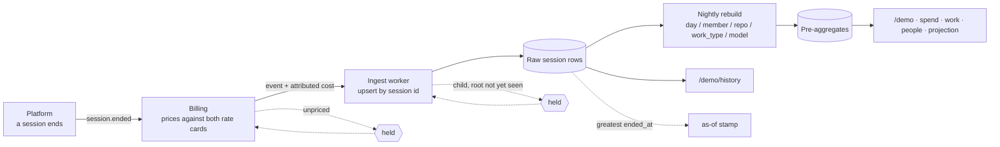

# Where sessions come from

This application reads rows. It prices nothing ([ADR-0005](adr/0005-session-cost-is-attributed-not-derived.md)),
computes no money, and takes the session row as given. This page is the sketch of what puts that row
in front of it, what it costs in latency, and what a reader sees when the pipeline misbehaves.

**None of it is built.** The fixture generator stands in for the whole chain, deliberately shaped by
where the data would really come from (`technical-spec.md` § 6, R-T19: *Sessions — platform events*).
The sketch exists so that the shape the product assumes is written down rather than implied by a
generator, and so that ingest failures have stated user-visible consequences instead of being
somebody's future surprise.

## The four steps

**1 — The platform emits `session.ended`.** At *end*, not at start, because every session measure is
observable at session end (`CONTEXT.md` § Session measures) and that is what keeps a session row
immutable and every metric free of an as-of date. One event per `AgentSession`, root or child, each
carrying its own id, its labels, its measures and its `parent_session_id`.

**2 — Billing attributes the cost.** It prices the session against the token and compute rate cards
and hands over one blended figure ([ADR-0005](adr/0005-session-cost-is-attributed-not-derived.md)).
The cards are billing's inputs, never this application's. *Authoritative money lives in billing, not
in analytics* — so a session that billing has not priced is not a row this application can hold: the
schema has no null cost, and inventing one would mean either dropping the row from money aggregates
or reading it as zero. Both undercount, and one of them undercounts silently. **An unpriced session
is held upstream of ingest**, not admitted with a hole in it.

**3 — The ingest worker upserts by session id.** The session id is the primary key and therefore the
deduplication store; no second one is needed. **An attempt is admitted whole**: a root plus every
child that names it. This costs one field on the root event — the fan-out size — which the platform
already has to state, since *Agents per session* is a panel figure ([ADR-0008](adr/0008-a-child-session-rolls-up-into-its-root.md)).

**4 — A nightly job rebuilds the pre-aggregates** at (day × member × repo × work_type × model)
grain — the same job [ADR-0009](adr/0009-scale.md) describes, and the reason the seam holds at ten
million sessions. It **recomputes each day partition from raw rows; it never increments one.** That
is what makes it re-runnable, and it is the property every late-arrival case below depends on.
Nightly is the right cadence rather than a compromise: the finest grain the product offers is a day
(R-M11), and a day's bucket is not final until the day is over.

## The latency budget

| From | To | p95 |
|---|---|---|
| Session ends | billing has priced it | 10 min |
| Priced event | upsert committed | 60 s |
| Root priced | last child of the attempt priced | + 10 min |
| Raw row | the five aggregate surfaces | next nightly rebuild |

**A session ending at 14:02 is a row `/demo/history` can show by about 14:15, and a figure the other
five surfaces state after that night's rebuild.** The two numbers differ by three orders of magnitude
because History alone reads raw rows and everything else reads pre-aggregates, and that is the
pipeline's most load-bearing consequence: *the dashboard's headline figures are a day behind its
history page, by design.*

**The observable is the as-of stamp** (R-N3.1, ticket 45), and what it does is worth stating exactly,
because it is not quite the watermark. `latestObservation` in `src/domain/observation.ts` selects the
session with the greatest **`ended_at`** — ties broken by id ascending, instants compared as numbers
— and `dataAsOf()` in `src/data/clock.ts` **prints that session's `started_at`**, in the
Organization's timezone. The selection is the honest ingest semantics; the printing is so the string
is character-for-character `/demo/history`'s top row and does not name a moment past `window_end`
(R-D2). Ticket 45 recorded both the choice and its cost: **the visible stamp understates the true
watermark by one session's duration.** The true watermark rides on the same value as `observedTo`,
and nothing renders it. Two consequences for ingest:

- **Alerting fires on `observedTo`, never on the label.** The gap between them is one session's
  duration, which a long session makes arbitrarily large. (Roadmap: *As-of freshness alerting*.)
- **The edge is always a root**, since a child ends before its root does and `loadDataset().sessions`
  holds roots only. The watermark therefore advances per *attempt*, which is the grain every
  session-level figure is stated at anyway.
- **At scale the stamp must be read off the pre-aggregate's watermark, not the raw one.** Today one
  load serves both surfaces so the single reading is correct; once the nightly job exists, a stamp
  read from raw rows would overstate the freshness of five surfaces out of six.

The stamp is a watermark, not a heartbeat: it says when the last observed session *started*, not when
ingest last ran. It resolves the ambiguity R-N3.1 exists for — an empty right-hand bucket under a
stamp reading today is a quiet week, under a stamp reading eight days ago is a stalled ingest — but
an idle fleet and a dead pipeline still produce the same stamp, which is why alerting needs an
expected arrival rate and not just a lag.

## Late and duplicate events

**A duplicate is a no-op by construction.** Same id, same key, and the measures are immutable after
session end, so the second write stores what the first one did. No dedup window, no ordering
assumption, no exactly-once delivery required of the platform.

**A child arriving before its root is the normal case, not the edge case.** Events are emitted at
session end, and a child ends *inside* its root's window (ADR-0008) — so a child's event always
precedes its root's. Ingest holds unresolved children keyed by the parent id they name, and **never
promotes one to a root**: a root is an attempt a Member launched, it is what every session-grain
metric counts, and it is the only row that carries `accepted`. Promoting an orphan would invent an
attempt, inflate session counts, and put a session with no acceptance criterion into the acceptance
denominator. A held child is visible on no surface, correctly: it has no root to roll into and it is
not a session in its own right.

**A late child whose root was already rolled up is the case that costs something.** The roll-up is
recomputed from raw rows and never applied as a delta, so re-running it cannot double-count — but
the child dirties **the partition of its root's start day**, not of its own, and a root can have
started days before the child arrives. So the rebuild window must be at least *longest session +
billing lag* wide, not "yesterday". Until it runs: `/demo/history` already shows the child row while
the five aggregate surfaces still hold the attempt's cost, tokens and machine time without it. **The
two surfaces disagree, and that disagreement is exactly the observable** — a session cost on History
that is larger than the aggregate it feeds means a partition is owed a rebuild.

## Three failure modes

| Failure | What happens | What the dashboard shows |
|---|---|---|
| **Billing lag** | Sessions end and are held unpriced; the raw rows behind them do not land | Every figure on screen stays *correct* — nothing partial is admitted. The as-of stamp stops advancing, and the right-hand end of every series thins as the most recent day fills in late. Nothing labels that last day incomplete: R-E2's partial-period flag covers the window's ends and the current month, not the last few hours of ingest. **The stamp is the only thing telling the reader, so a reader who does not look at it reads a real dip.** |
| **A mid-month rate change** | Billing prices each session at the card in force when it ran, so two prices land inside one reporting window | The aggregates stay right — they sum attributed figures, which are the bill. **The rate card on `/demo/spend` goes quietly wrong**: it is one card with no effective-from, so it states one of the two prices for the whole window, and ADR-0005's noted risk that *a stored cost can disagree with the displayed card* becomes real. Worse, a spend rise is now ambiguous between more usage and a higher price, and no surface can tell the reader which — which is the exact ambiguity `CONTEXT.md` § Rate card makes the cards period-stable to prevent. Tier spend and Model mix read as a behaviour change that never happened. |
| **A session with no tracker key** | The platform *refuses to launch an AgentSession without one* (`CONTEXT.md` § Work), so this event cannot occur; if it does, the upstream invariant has already broken. Ingest **rejects it to a dead-letter queue** rather than admitting it with a synthesised key | **Nothing — on any surface, including `/demo/history`.** The stamp does not advance past it and its cost is missing from Total spend, unmarked. That is the deliberate trade: a synthetic key per session makes every such session its own Task and therefore a first-time success, deflating Rework and Decomposition; one shared placeholder key makes them one Task attempted *n* times, a fabricated Rework spike. Both corrupt two of the product's three differentiator metrics — *the distinction between Task and AgentSession exists so that Rework is measurable*. A missing row understates money; a synthetic key falsifies the claim the product is for. The failure is visible to the operator (dead-letter depth) and to nobody else. |

Two of these three are stated impossibilities — a period-stable card cannot change mid-window, and a
session cannot exist without a tracker key. They are here precisely for that reason: **an invariant
with no stated behaviour on violation is an invariant that fails silently**, and the honest answer is
what the product does when its own guarantee is broken by the system upstream of it.

The product already has one class of rows it drops at the boundary — hidden sessions, stripped once
in `src/data/load.ts` (R-M2) — so the dead-letter case is the same shape as an existing rule rather
than a new kind of hole. The difference is that the hidden strip is a decision and this one is a
fault, which is why it belongs in a queue somebody watches.

## Open

- **The rate card needs an effective-from** before a mid-window change can be represented at all. The
  cheap version reuses one mechanism the product already ships: R-E2's partial-period flag, raised on
  any window spanning a change. Not specified here; it is a spec change, not a document.
- **The unpriced-session hold assumes billing eventually prices everything.** A session billing
  never prices is indistinguishable, from ingest's side, from one it has not priced yet.

See also: [`CONTEXT.md`](../CONTEXT.md) § Models & Money · [ADR-0005](adr/0005-session-cost-is-attributed-not-derived.md)
· [ADR-0008](adr/0008-a-child-session-rolls-up-into-its-root.md) · [ADR-0009](adr/0009-scale.md) ·
[`docs/roadmap.md`](roadmap.md).
